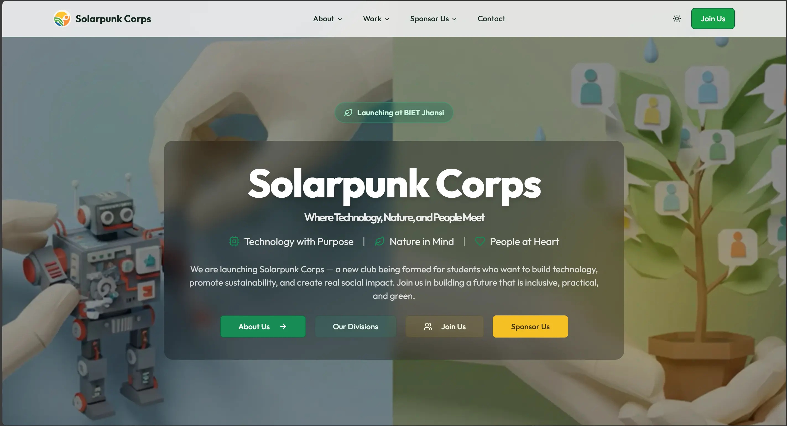

# SPC Website



Official website for the Solarpunk Corps (SPC).

## 🚀 About

This project is a full-stack web application designed to showcase the projects, team, and mission of the Solarpunk Corps. It features a modern, responsive design with dynamic themes and interactive elements.

## ✨ Features

- **Interactive Projects Hub**: Dedicated pages for key initiatives like the Rover, Magazine, and Survey projects.
- **Enhanced About Section**: Detailed "Who We Are" narrative with a dynamic "What Do We Actually Do?" showcase.
- **Support Ecosystem**: Dedicated portals for Membership, Sponsors, and a new Alumni Support network.
- **UX-First Navigation**: Redesigned Footer with clear categorization (Organization, Initiatives, Connect) for better discoverability.
- **Dynamic Theming**: Built-in support for Light and Dark modes.
- **Interactive Animations**: Custom "Pluck" effects on project cards and interactive icons.
- **Hidden Easter Egg**: Hunt for the hidden surprise within the site!

## 🛠 Tech Stack

### Frontend
- **Framework**: React with Vite
- **Language**: TypeScript
- **Styling**: Tailwind CSS, Shadcn/UI (Radix Primitives)
- **Animations**: Framer Motion
- **Routing**: wouter
- **State Management**: TanStack Query (React Query)

### Backend
- **Runtime**: Node.js
- **Server**: Express.js
- **Data Handling**: Google Apps Script (Forms), In-Memory (Session)
- **Authentication**: Passport.js

## 📂 Project Structure

```
├── client/
│   ├── src/
│   │   ├── components/   # Reusable UI components
│   │   ├── pages/        # Application routes/pages
│   │   ├── lib/          # Utilities and helpers
│   │   ├── hooks/        # Custom React hooks
│   │   └── App.tsx       # Main application component
├── server/
│   ├── index.ts          # Backend entry point
│   ├── routes.ts         # API routes definition
│   └── storage.ts        # Database storage interface
├── shared/
│   └── schema.ts         # Shared TypeScript types & Drizzle schema
└── attached_assets/      # Static assets and reference files
```

## 🚀 Getting Started

### Prerequisites
- Node.js (v20 or higher recommended)

### Installation

1. **Clone the repository**
   ```bash
   git clone <repository-url>
   cd spc-website
   ```

2. **Install dependencies**
   ```bash
   npm install
   ```

3. **Environment Setup**

   This project uses environment variables for external API integrations (Google Scripts).

   1.  **Create a `.env` file** in the root directory.
   2.  **Add the following variables**:

       ```env
       # External Integrations (Required for Forms)
       VITE_GOOGLE_SCRIPT_ALUMNI_URL=your_google_script_web_app_url_for_alumni
       VITE_GOOGLE_SCRIPT_PARTNER_URL=your_google_script_web_app_url_for_partners
       ```

       > **Note:** The Google Script URLs are required for the Alumni and Partner forms to function correctly. If you are forking this repo, you will need to set up your own Google Apps Script (or similar backend) and provide the Web App URL here.

### Running the App

To start the development server (runs both client and server concurrently):

```bash
npm run dev
```

The application will typically be available at `http://localhost:5000`.

### Scripts
- `npm run dev`: Start the development server.
- `npm run build`: Build the application for production.
- `npm run start`: Start the production server.
- `npm run check`: Run TypeScript type checking.

---
*Built for the Solarpunk Corps*
