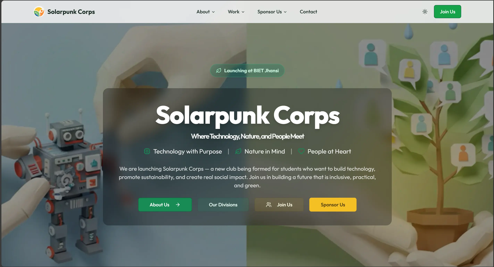

# SPC Website



Official website for **Solarpunk Corps (SPC)** — a student-led robotics and sustainability club at BIET Jhansi.

This README is the maintainer guide. Read it before adding, removing, or editing pages, images, navigation, or notifications.

---

## Quick start

```bash
npm install
npm run dev      # http://localhost:5000
npm run build    # production build + prerender
npm run start    # production server
npm run check    # TypeScript check
```

### Environment variables (`.env` in project root)

```env
VITE_GOOGLE_SCRIPT_ALUMNI_URL=your_google_script_web_app_url_for_alumni
VITE_GOOGLE_SCRIPT_PARTNER_URL=your_google_script_web_app_url_for_partners
```

Required for Alumni and Partner form submissions.

### Site lock modes (`client/src/config/site.ts`)

| `SITE_LIVE` | `INAUGURATION_MODE` | Behavior |
|---|---|---|
| `true` | any | Full site live (production) |
| `false` | `true` | Coming Soon page with unlock button |
| `false` | `false` | Coming Soon, strictly locked |

---

## Folder structure (what lives where)

```
SPC-website/
├── client/                     # Frontend (React + Vite)
│   ├── index.html              # HTML shell; meta placeholders for SSR
│   ├── public/                 # Static files served as-is (images, robots.txt, sitemap)
│   │   ├── Photos/             # Team headshots
│   │   └── Horizon1/           # Horizon 1.0 event photos (.webp)
│   └── src/
│       ├── App.tsx             # ★ Route table — every URL maps here
│       ├── main.tsx            # Client entry point
│       ├── entry-server.tsx    # SSR/prerender entry
│       ├── index.css           # Global styles, custom fonts, Horizon theme classes
│       ├── config/
│       │   └── site.ts         # SITE_LIVE / INAUGURATION_MODE flags
│       ├── lib/
│       │   ├── navigation.ts   # Scroll-to-section helpers, /membership → /structure#apply-now
│       │   ├── queryClient.ts  # TanStack Query setup
│       │   └── utils.ts        # cn() and shared utilities
│       ├── hooks/
│       │   └── use-toast.ts    # Toast notification hook
│       ├── components/         # Reusable UI (see section below)
│       └── pages/              # One file per route (see Route Map below)
│
├── server/                     # Express backend (minimal — mostly static serving)
│   ├── index.ts                # Server entry
│   ├── routes.ts               # API routes
│   └── storage.ts              # Session/storage interface
│
├── script/
│   ├── build.ts                # Full build pipeline (client → SSR → prerender → server)
│   └── prerender.ts            # Static HTML generation; route list must match sitemap
│
├── shared/
│   └── schema.ts               # Shared TypeScript types
│
└── attached_assets/            # Reference files & design drafts (NOT served to users)
    ├── Images/                 # Source/reference images (copy into client/public to use)
    ├── *.html                  # Old standalone page prototypes
    └── screenshot.webp         # README screenshot only
```

---

## Images & assets guide

All live website images go in **`client/public/`**.  
Anything in `attached_assets/` is for reference only — the browser cannot load it unless you copy it into `public/`.

### `client/public/` — what each file/folder is for

| Path | Used on | Referenced from |
|---|---|---|
| `SPC_logo.png` | Nav, footer, hero, coming-soon, SEO | `navigation.tsx`, `footer.tsx`, `seo.tsx`, `horizon1-0.tsx` |
| `Photos/*.jpeg` | **Our Team** page member headshots | `pages/our-team.tsx` (each person has a `const imgN = "/Photos/Name.jpeg"`) |
| `Horizon1/*.webp` | **Horizon 1.0** landing + wrap-up event photos | `pages/horizon1-0.tsx`, `pages/horizon1-2026.tsx` |
| `world pic.webp` | Nav dropdown "About" card background | `navigation.tsx` |
| `work-cover.webp` | Nav dropdown "Work" card background | `navigation.tsx` |
| `sponser pic.webp` | Nav dropdown "Sponsor Us" card background | `navigation.tsx` |
| `hourglass.webp` | Home Horizon teaser + Events page | `pages/home.tsx`, `pages/events.tsx` |
| `greenshift.webp` / `greenshift-vision.webp` | Greenshift event (if linked) | events-related pages |
| `rover.webp`, `magazine.webp`, `survey.webp` | Projects cards | `components/projects-section.tsx`, `pages/home.tsx` |
| `csr.webp` | Hero + About background texture | `components/hero-section.tsx`, `components/about-section.tsx` |
| `robots.txt`, `sitemap.xml` | SEO / crawlers | served directly |
| `google620443bc81af781b.html` | Google Search Console verification | served directly |

### How to add a new image

1. Put the file in `client/public/` (or a subfolder like `client/public/Horizon1/`).
2. Reference it in code as `/filename.webp` or `/Horizon1/filename.webp`.
3. **Do not** prefix paths with `/public/` — Vite serves `client/public/` at the site root.
4. **Match filename casing exactly** — Linux production servers are case-sensitive (`Inauguration1.webp` ≠ `inaguration1.webp`).
5. Run `npm run build` to include it in production output.

### Team photos workflow

1. Add JPEG to `client/public/Photos/Firstname.jpeg`
2. Open `client/src/pages/our-team.tsx`
3. Add a `const imgN = "/Photos/Firstname.jpeg"` at the top
4. Assign that constant to the member object in the team data array

---

## Route map — URL → page file → sections

Routes are defined in **`client/src/App.tsx`**.  
Each page file is a thin wrapper: it mounts `<Navigation />`, content sections, and `<Footer />`.

| URL | Page file | Main content / components |
|---|---|---|
| `/` | `pages/home.tsx` | `HeroSection` + inline home sections (mission, Horizon teaser, projects, sponsors CTA) |
| `/about` | `pages/about.tsx` | `AboutSection`, `VisionSection` |
| `/structure` | `pages/structure.tsx` | `MembershipSection` (tiers + **Apply now** form), `DivisionsSection` |
| `/membership` | redirect in `App.tsx` | Redirects to `/structure#apply-now` |
| `/what-we-do` | `pages/what-we-do.tsx` | `WhatWeDoSection` |
| `/projects` | `pages/projects.tsx` | `ProjectsSection` |
| `/projects/rover` | `pages/project-rover.tsx` | Full Rover project page (self-contained) |
| `/projects/magazine` | `pages/project-magazine.tsx` | CodeGreen magazine page |
| `/projects/survey` | `pages/project-survey.tsx` | Campus Survey page |
| `/events` | `pages/events.tsx` | Events listing (Horizon card, upcoming events) |
| `/events/horizon` | `pages/horizon1-0.tsx` | Horizon 1.0 landing (roadmap, carousel, CTA to wrap-up) |
| `/events/horizon1-2026` | `pages/horizon1-2026.tsx` | Horizon 1.0 wrap-up / archive (photo galleries, teams, winners) |
| `/sponsors` | `pages/sponsors.tsx` | `SupportSection` + sponsorship flipbook embed |
| `/sponsors/alumni` | `pages/alumni.tsx` | Alumni support form |
| `/alumni` | `pages/alumni.tsx` | Same as above (alias) |
| `/sponsors/partner` | `pages/partner.tsx` | Corporate partner form |
| `/our-team` | `pages/our-team.tsx` | Team grid — all data + photos in this one file |
| `/contact` | `pages/contact.tsx` | `ContactSection`, `FaqSection` |
| `/csr` | `pages/csr.tsx` | CSR page (self-contained, large single file) |
| `/manifesto` | `pages/manifesto.tsx` | Manifesto essay (self-contained) |
| `/hidden-egg` | `pages/hidden-egg.tsx` | Easter egg game |
| `/experience-spc` | `pages/experience-spc.tsx` | Experimental page |
| `/under-construction` | `pages/under-construction.tsx` | Placeholder page |
| `*` (404) | `pages/not-found.tsx` | Not found page |

> **Adding a new page:** create `pages/your-page.tsx`, add a `<Route>` in `App.tsx`, add the URL to `client/public/sitemap.xml` and `script/prerender.ts` if you want it pre-rendered for SEO.

---

## Shared layout components (appear on almost every page)

| File | Controls |
|---|---|
| `components/navigation.tsx` | Top navbar, dropdown menus, **"What's New?" notification popup**, theme toggle, **Join Us** button |
| `components/footer.tsx` | Footer links (Organization / Initiatives / Connect), social icons, visitor counter |
| `components/seo.tsx` | `<title>`, meta description, Open Graph tags per page |
| `components/theme-toggle.tsx` | Sun/moon light-dark mode button |
| `components/theme-provider.tsx` | Theme state (stored in localStorage as `spc-theme`) |
| `components/scroll-to-top.tsx` | Floating "back to top" button (bottom-right) |

---

## Page section components (what controls each part of a page)

These are imported by page files. Edit the component to change that section everywhere it appears.

| Component file | Section it renders | Used on |
|---|---|---|
| `hero-section.tsx` | Home hero banner, tagline, CTA buttons (About, Divisions, Join Us, Sponsor) | `/` |
| `about-section.tsx` | "Who We Are" narrative | `/about` |
| `vision-section.tsx` | Vision / values cards | `/about` |
| `membership-section.tsx` | Membership tiers + **"Apply now."** Google Form CTA (`id="apply-now"`) | `/structure` |
| `divisions-section.tsx` | 9 club divisions grid (`id="divisions"`) | `/structure` |
| `what-we-do-section.tsx` | Activities overview | `/what-we-do` |
| `projects-section.tsx` | Project cards (Rover, Magazine, Survey) | `/projects` |
| `support-section.tsx` | Sponsor/alumni/partner overview cards | `/sponsors` |
| `contact-section.tsx` | Contact form and info | `/contact` |
| `faq-section.tsx` | FAQ accordion (`id="faq-top"`) | `/contact` |
| `leadership-section.tsx` | Leadership highlights (if used) | various |
| `sponsor-section.tsx` | Sponsor logos / CTA blocks | sponsor-related pages |

---

## Notification popup ("What's New?")

**File:** `client/src/components/navigation.tsx`  
**Location in UI:** Top-right navbar — sparkle button labeled **"What's New?"**

To change the notification content, edit the block inside `{isNotifOpen && (...)}` (~lines 408–465):

| What to change | Where in `navigation.tsx` |
|---|---|
| Event title ("Horizon 1.0") | `<h3>` inside the popup |
| Subtitle ("Beyond the Machine") | `<p>` below the title |
| Description text | `<p className="text-[11px]...">` |
| Button label ("Explore the Vision") | `<Button>` text |
| Button destination | `handleNavigate(e, "/events/horizon")` — change the URL string |
| Show/hide ping dot | `{!isNotifOpen && (...)}` animated dot |

There is no separate notification config file — everything is inline in `navigation.tsx`.

---

## Navigation & scroll behavior

| File | Purpose |
|---|---|
| `lib/navigation.ts` | `navigateWithScroll()`, `resolveHref()` — `/membership` → `/structure#apply-now`, hash scroll via sessionStorage |
| `App.tsx` | Route table; `MembershipRedirect` component; scrolls to pending anchor after page change |
| `navigation.tsx` | Desktop/mobile nav links; Join Us → `/structure#apply-now` |
| `footer.tsx` | Footer link clicks with section anchors |

**Important anchors:**

| Anchor ID | Section |
|---|---|
| `apply-now` | Membership apply form on `/structure` |
| `divisions` | Divisions grid on `/structure` |
| `membership-top` | Top of membership tiers section |
| `structure-top` | Top of structure page |
| `faq-top` | FAQ on contact page |

---

## Horizon event pages — where to add photos

Event photos live in **`client/public/Horizon1/`** (18 `.webp` files):

```
Inauguration1.webp … Inauguration4.webp
DayOne1.webp, DayOne2.webp
DayTwo1.webp … DayTwo7.webp
DayThree1.webp … DayThree5.webp
```

**Correct path in code:** `/Horizon1/Inauguration1.webp`  
**Wrong:** `/public/Horizon1/...` or `client/public/Horizon1/...`

Both Horizon pages use a **grayscale → color on hover** effect on all photos. The lightbox (click to enlarge) always shows full color.

---

### `/events/horizon` → `client/src/pages/horizon1-0.tsx`

Horizon 1.0 **landing page** (roadmap, CTA to wrap-up).

| Section | Lines (approx.) | How to change photos |
|---|---|---|
| Hero logo | ~80 | Fixed: `/SPC_logo.png` |
| **"Glimpses of Horizon" carousel** | ~569–601 | Edit the string array of `/Horizon1/...` paths |
| Lightbox (click to enlarge) | ~618–647 | Uses the same URL passed from the carousel click |

---

### `/events/horizon1-2026` → `client/src/pages/horizon1-2026.tsx`

Horizon 1.0 **wrap-up / archive** page. This file has helper utilities at the top — edit these first when swapping photos in bulk.

#### Shared helpers (top of file, ~lines 31–103)

| Symbol | Purpose |
|---|---|
| `HORIZON_PHOTOS` | Master list of all 18 local photo paths |
| `hz(i)` | Returns `HORIZON_PHOTOS[i % 18]` — cycles photos when there are more slots than files |
| `RoadmapPhoto` | Timeline grid photo (Kick-Off, Day 1–3 sections) |
| `HeartPhoto` | Heart-shaped footer gallery cell |
| `HORIZON_IMG_HOVER` | B&W → color on direct image hover |
| `HORIZON_IMG_GROUP_HOVER` | B&W → color when hovering the parent card/container |

#### Section map

| Section | Lines (approx.) | How images are assigned |
|---|---|---|
| **Glimpses carousel** | ~207–237 | Hardcoded `/Horizon1/...` string array (same pattern as horizon1-0) |
| **Event Roadmap — Kick-Off** | ~289–293 | Explicit paths: `/Horizon1/Inauguration1.webp` … `Inauguration4.webp` |
| **Event Roadmap — Virtual Tinkering (Day 1)** | ~308–312 | `hz(4)`, `hz(5)`, etc. |
| **Event Roadmap — Evolution (Day 2)** | ~327–330 | `hz(6)` … `hz(9)` |
| **Event Roadmap — Showdown (Day 3)** | ~345–349 | `hz(13)` … `hz(17)` |
| **The Vanguard** (team cards) | ~366–378 | `{ name, bg, img: hz(N) }` array — change `img` per team |
| **The Champions** (podium) | ~411–440 | Inline `hz(11)`, `hz(13)`, `hz(15)` for 2nd / 1st / 3rd |
| **Heart gallery** (footer grid) | ~459–522 | `<HeartPhoto src={hz(N)} … />` — emoji cells (#HZ, 🤍, ⚡, 🤔, 🤖, 🌿) are not photos |
| **Lightbox** | ~545–560 | Full color — do not add grayscale here |

#### Recommended workflows

**Replace one photo everywhere it appears:**
1. Overwrite the file in `client/public/Horizon1/` (keep the same filename), or
2. Change the path in the `HORIZON_PHOTOS` array at the top of `horizon1-2026.tsx`.

**Add a new photo to the pool:**
1. Drop `client/public/Horizon1/MyPhoto.webp`
2. Add `"/Horizon1/MyPhoto.webp"` to `HORIZON_PHOTOS`
3. Reference it via `hz(N)` or a direct path in the section you want

**Change which photo a specific slot shows:**
- Carousel / Kick-Off: edit the path string directly in that section
- Roadmap days, teams, heart grid: change the `hz(N)` index number
- Vanguard teams: edit the `img` field in the team objects array (~line 366)

**Change hover effect sitewide on this page:**
Edit `HORIZON_IMG_HOVER` or `HORIZON_IMG_GROUP_HOVER` near the top of `horizon1-2026.tsx`.

---

## Other files worth knowing

| File | Purpose |
|---|---|
| `vite.config.ts` | Vite build config, path aliases (`@/` → `src/`) |
| `tailwind.config.ts` | Tailwind theme extensions |
| `client/public/sitemap.xml` | SEO sitemap — update when adding routes |
| `script/prerender.ts` | Routes pre-rendered to static HTML at build time |
| `components/ui/` | Shadcn/UI primitives (Button, Card, Dialog, etc.) — rarely edit directly |
| `pages/membership.tsx` | Old standalone membership page — **not routed**; content lives in `MembershipSection` on `/structure` |
| `pages/horizon.tsx` | Older Horizon vision page — **not routed**; replaced by `horizon1-0.tsx` |

---

## Common tasks (cheat sheet)

### Add a new nav link
1. Edit link arrays in `navigation.tsx` (desktop dropdown + mobile menu)
2. Add matching link in `footer.tsx` if needed

### Change the membership / apply form URL
Edit the Google Forms link in `components/membership-section.tsx` (~line 171).

### Add a team member
1. Photo → `client/public/Photos/`
2. Data + photo assignment → `pages/our-team.tsx`

### Change Join Us / membership link destination
All "Join Us" and `/membership` links go to **`/structure#apply-now`**.  
Logic lives in `lib/navigation.ts` (`resolveHref`, `navigateWithScroll`) and `App.tsx` (`MembershipRedirect`).

### Swap Horizon event photos
See **Horizon event pages** section above. Quick version: edit `client/public/Horizon1/` files and/or `HORIZON_PHOTOS` + section indices in `horizon1-2026.tsx`.

### Add a new project page
1. Create `pages/project-yourname.tsx`
2. Add route in `App.tsx`
3. Add card in `components/projects-section.tsx`
4. Update `sitemap.xml` and `script/prerender.ts`

### Change site-wide theme default
Edit `ThemeProvider defaultTheme` in `App.tsx`.

---

## Tech stack

- **Frontend:** React, TypeScript, Vite, Tailwind CSS, Shadcn/UI, Framer Motion, wouter
- **Backend:** Node.js, Express
- **Forms:** Google Apps Script (Alumni, Partner)
- **Build:** Custom SSR prerender pipeline (`script/build.ts`)

---

*Built for the Solarpunk Corps 🌱*
